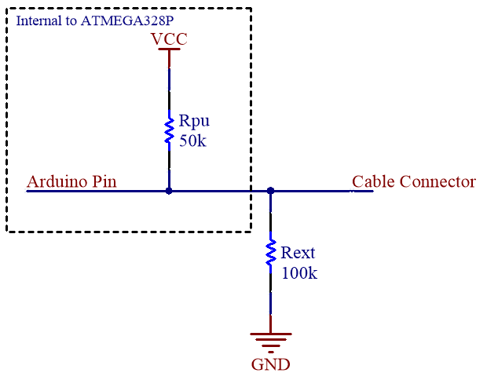

#Wireless Continuity Tester

This project is aims to be able to identify connections between up to 8 cables with both ends of the 8 cables being far away from each other with two microcontroller based units, one on each end without being connected through a dedicated ground reference.

These units in this project will be using AliExpress Arduino Nanos with the HC11 433MHz Wireless modules for communication between them.

Each channel (connection for a cable) has an external 100k pull-down resistor soldered to it.

The units split their tasks into two parts: Testing for local connections (connections between cables attached to a single unit) and testing for foreign connections (connections between cables with both ends attached to different units)

##Testing for local connections
A single pin A is chosen as the pin under test. The remaining pins are iterated over, one pin at a time, henceforth called pin B. To test for a connection between pin A and B, all other pins are set as INPUTS (HI-Z), then B is set to output HIGH. The state of pin A is then tested. If 	HIGH, then A can be said to be connected to B. If LOW, it should be an error state because it should not be possible (All other channels are effectively pulled-down, A should read HIGH even if connected to such a pull-down). If pin A is floating, pin A is NOT connected to pin B.

In this manner, assigning the remaining pins as pin B one at a time, it can be tested which other pins are connected to pin A. These connected pins will henceforth be called a *group*. Each group has a *leader*, pin A, and the other connected pins will be referred to as being in group A.